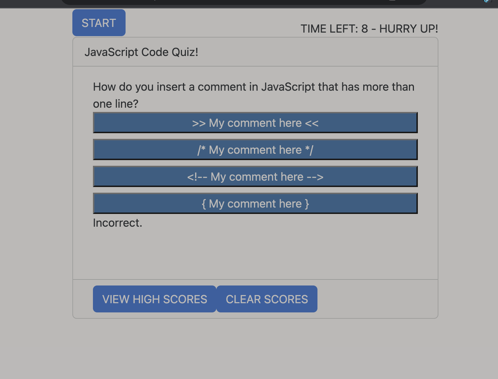
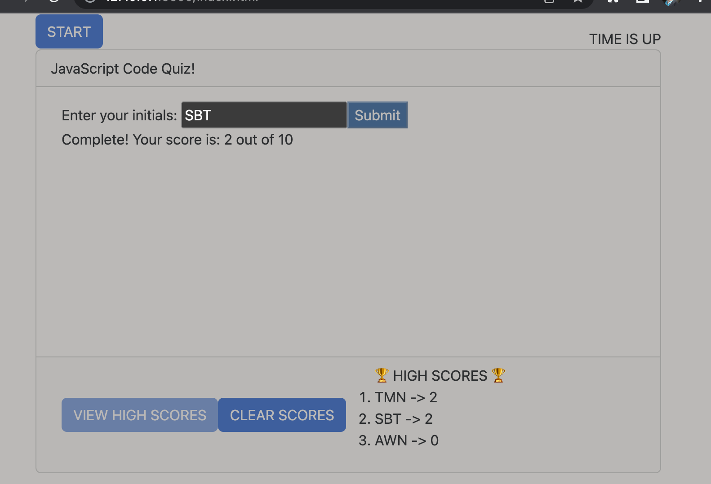

# <Code-Quiz>

## Description

Provide a short description explaining the what, why, and how of your project. Use the following questions as a guide:

- This quiz was built to test the user on their JavaScript knowledge. The page has increased functionality and enhanced user experience over previous projects, utilizing the DOM and Bootstrap stylings. This project displays the ability of JavaScript to change aspects of the web page on the fly and how it can access local memory. Bootstrap adds quick and easy aesthetic changes. By completing this project, I learned more ways to interact with a basic web page so that it feels live and user-friendly. 

## Table of Contents

If your README is long, add a table of contents to make it easy for users to find what they need.

- [Usage](#usage)
- [Credits](#credits)
- [License](#license)

## Usage

This quiz is fairly simple to use. You can click start to start the quiz, or you can click the high scores button to see if there are any high scores posted. If there are, you can clear them out with the clear score button. If there are none, then a "No high scores yet!" message will appear above the quiz. 

The quiz: Each question displays four answers as buttons. If you click the right one, "Correct!" displays. If not, "Incorrect." displays. For each correct question, the quiz adds to the score counter and moves on to the next question. If answered incorrectly, the timer is decremented by 10 seconds. When the timer is down to 10 seconds or less, an urgent message will appear. 

The quiz ends either when there are no more questions or when the timer is ended. A field to enter initials and a submit button will appear. When you type in intitials and hit submit, your score and initials will be added to the local memory, and will display on the high score list if the button is clicked. 

## Credits

Guides/Sources:  

https://simplestepscode.com/javascript-quiz-tutorial/

https://www.sitepoint.com/simple-javascript-quiz/

https://www.codewithrandom.com/2023/02/18/quiz-apps-using-javascript/

https://getbootstrap.com/docs/5.3/getting-started/introduction/

For most questions:
https://www.w3schools.com/quiztest/quiztest.asp?qtest=JS

Third-party assets:

## License

MIT License

Copyright (c) [2023] [Andrew Nalley]

Permission is hereby granted, free of charge, to any person obtaining a copy
of this software and associated documentation files (the "Software"), to deal
in the Software without restriction, including without limitation the rights
to use, copy, modify, merge, publish, distribute, sublicense, and/or sell
copies of the Software, and to permit persons to whom the Software is
furnished to do so, subject to the following conditions:

The above copyright notice and this permission notice shall be included in all
copies or substantial portions of the Software.

THE SOFTWARE IS PROVIDED "AS IS", WITHOUT WARRANTY OF ANY KIND, EXPRESS OR
IMPLIED, INCLUDING BUT NOT LIMITED TO THE WARRANTIES OF MERCHANTABILITY,
FITNESS FOR A PARTICULAR PURPOSE AND NONINFRINGEMENT. IN NO EVENT SHALL THE
AUTHORS OR COPYRIGHT HOLDERS BE LIABLE FOR ANY CLAIM, DAMAGES OR OTHER
LIABILITY, WHETHER IN AN ACTION OF CONTRACT, TORT OR OTHERWISE, ARISING FROM,
OUT OF OR IN CONNECTION WITH THE SOFTWARE OR THE USE OR OTHER DEALINGS IN THE
SOFTWARE.

---

🏆 The previous sections are the bare minimum, and your project will ultimately determine the content of this document. You might also want to consider adding the following sections.

## Features

HTML
CSS
JavaScript
Bootstrap

